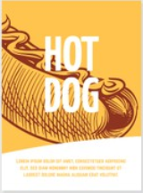

# Liquid Layout Mobile Static Site

## Layout
#### body
```css
body{
    /*width = window.width*/
    width: 100%;
    min-width: 320px;
    max-width: 750px;
    /*center*/
    margin: 0 auto;
}
```
---
#### header
there are 4 boxs in a line,i used <li> tags
```html
  <header class="app">
        <ul>
            <li></li>
            <li></li>
            <li>Amond</li>
            <li>about</li>
        </ul>
    </header>
```
---
#### banner
**圣杯布局**
```html
 <div class="search-wrap">
        <div class="search-btn"></div>
        <div class="search"></div>
        <div class="search-login"></div>
    </div>
```
**两侧box**固定高宽
**中间box**百分比宽度，固定高，设定margin
```css
.search-wrap {
    height: 40px;
    position: fixed;
    width: 100%;
    min-width: 320px;
    max-width: 750px;
    overflow: hidden;
    text-align: center;
    line-height: 40px;
    color: white;
}
```
---
#### nav
``` html
       <nav>
            <a href="javascript:;">
                
            </a>
            <a href="javascript:;">
                
            </a>
            </a>
            <a href="javascript:;">
                
            </a>
            </a>
            <a href="javascript:;">
                
            </a>
            </a>
            <a href="javascript:;">
                
            </a>
        </nav>
```


## API Events

### slider_box 
1. move by itself
2. move by finger touch
#### setInterval